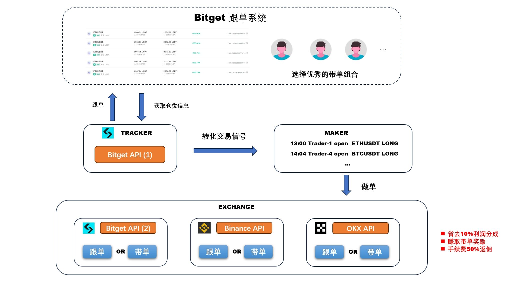
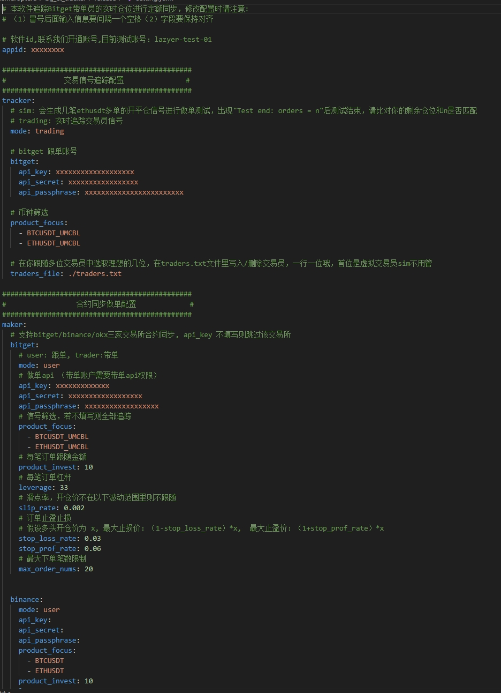
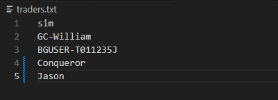
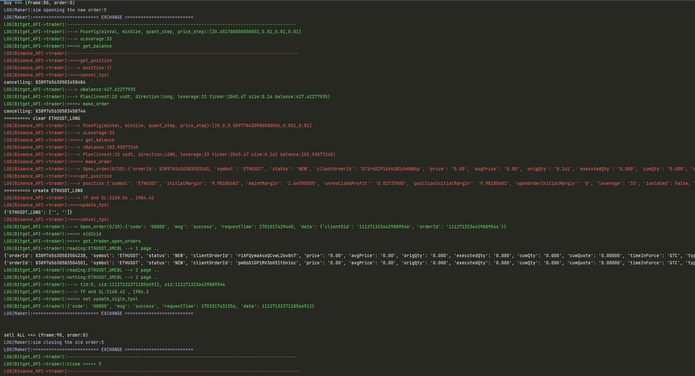

# Bitget跨平台跟单/带单助手
#### 技术支持：懒人交易策略研发团队
#### 币安带单: 懒人交易
#### twitter: @lazyer_trading
#### telegram: https://t.me/bn_ct_track
#### email: lazyer.trading@gmail.com
#### 欢迎加入Bitget节点计划：https://partner.bitget.fit/bg/1KPPQ8 注册交易返佣
#### 建议使用linux云服务器后台长期运行，轻量级机器租用（5u/月）可以参考腾讯云（不要购买大陆和美国区域，访问不了币安！）：https://cloud.tencent.com/product/lighthouse
### **github帮忙star后可联系我们开通一个月测试账号**

## 1.服务介绍
24小时追踪优质的带单信号，同步到各平台合约账户进行做单

## 2.软件下载
目前支持windows版本和linux版本：
软件地址： https://github.com/lazyer-trading/bitget_copytrading_assistant/releases

## 3.获取服务
加入Bitget节点计划，获取高额返佣，注册链接：https://partner.bitget.fit/bg/1KPPQ8
#### VIP-1: 使用上述链接注册并入金500u以上，可获取BG助手跟单/带单功能 
#### VIP-2: 定制专属服务（120u/月），可获取BG助手跨平台跟单/带单功能 （binance/okx）

## 4.软件使用
### 4.1 配置
修改setting.yaml文件, 参考文件里标注，最好用sublime/vscode打开，观感更好

### 4.2 选择交易员
在traders.txt写入或删除你的交易员，不用停止软件，一行填写一位，sim是虚拟交易员不用删掉

### 4.3 软件运行

## 5.加入我们
